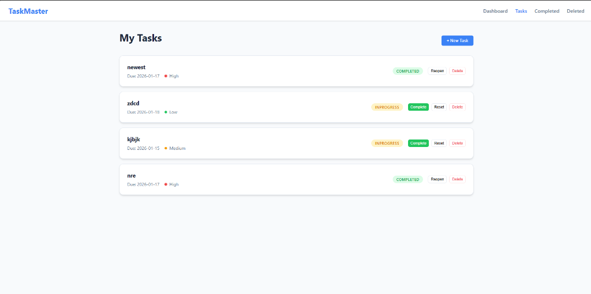

# TaskMaster - Todo App

A modern, full-stack task management application built with **.NET 10** (Backend) and **Angular 20** (Frontend). Designed for efficiency and performance with a clean, responsive UI.

## 📸 Demo


*Dashboard Overview*


*Task Management Interface*

## 🚀 Features

*   **Task Management**: Create, update, delete, and track tasks (In Progress, Completed).
*   **Dashboard**: Real-time statistics and visual distribution of tasks.
*   **Urgency Levels**: Prioritize tasks with Low, Medium, and High urgency.
*   **Clean Architecture**: Separation of concerns using DDD implementation.
*   **Performance**: Fast, signal-based Angular frontend and optimized .NET API.

## 🛠️ Tech Stack

*   **Frontend**: Angular 20, Signals, Standalone Components, CSS Variables.
*   **Backend**: .NET 10, ASP.NET Core Web API, Minimal APIs.
*   **Database**: MongoDB (NoSQL).

## 🏃‍♂️ Getting Started

### Prerequisites
*   .NET 10 SDK
*   Node.js (v18+) & npm
*   MongoDB running locally on port `27017`

### Backend Setup
```bash
cd src/TodoApp.API
dotnet run
```
*API will run at `http://localhost:5000`*

### Frontend Setup
```bash
cd todo-client
npm install
npm start
```
*App will run at `http://localhost:4200`*
